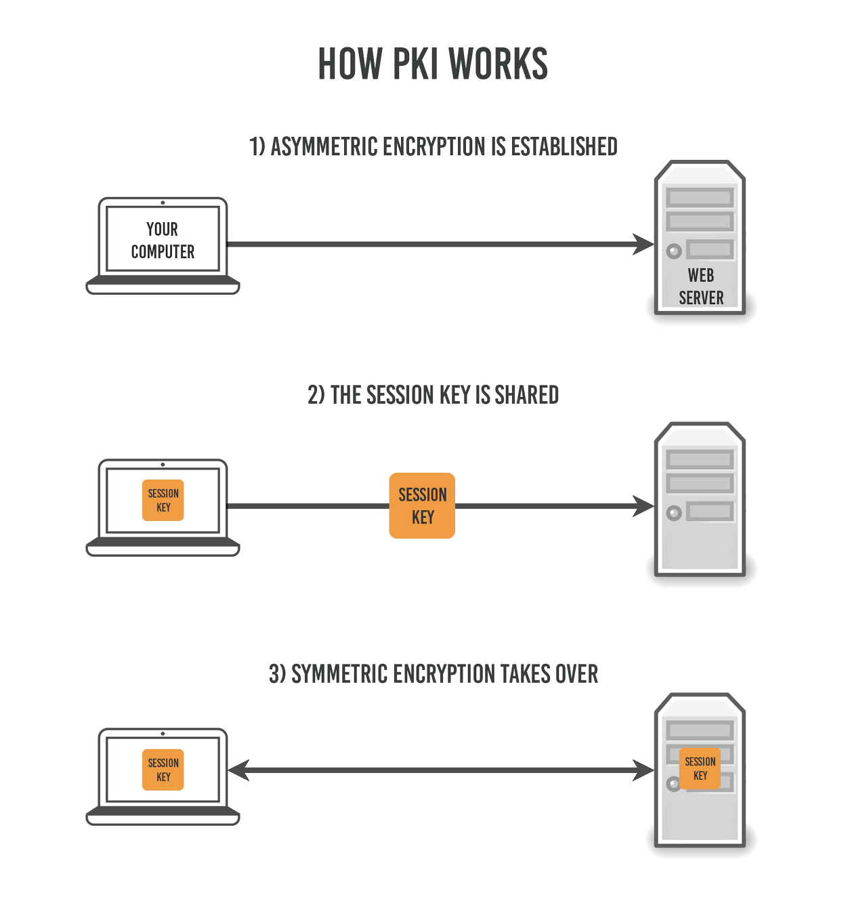
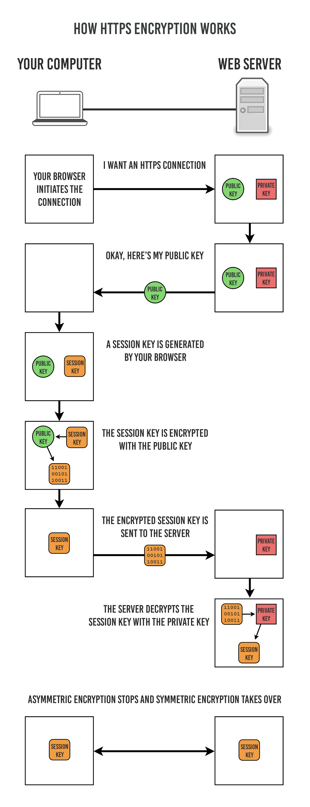

[학습자료: 망나니개발자 블로그](https://mangkyu.tistory.com/98)

## https란?
HTTPS는 HTTP에 데이터 암호화가 추가된 프로토콜이다.
```markdown
HyperText Transfer Protocol over Secure Socket Layer
HTTP over TLS
HTTP over SSL
HTTP Secure 등으로 불리는 HTTPS는 HTTP에 데이터 암호화가 추가된 프로토콜이다. 
HTTPS는 HTTP와 다르게 443번 포트를 사용하며, 네트워크 상에서 중간에 제3자가 정보를 볼 수 없도록 암호화를 지원하고 있다.
```

### 암호화 방식
- 대칭키 암호화
  - 클라이언트와 서버가 동일한 키를 사용해 암호화/복호화를 진행함
  - 키가 노출되면 매우 위험하지만 연산 속도가 빠름
  
- 비대칭키 암호화
  - 1개의 쌍으로 구성된 공개키와 개인키를 암호화/복호화 하는데 사용함
  - 키가 노출 되어도 비교적 안전하지만 연산 속도가 느림

### 동작과정
HTTPS는 대칭키 암호화와 비대칭키 암호화를 모두 사용하여 연산 속도와 안정성을 모두 얻고 있다.
HTTPS는 연결과정(Hand-Shaking)에서는 먼저 서버와 클라이언트 간에 세션키를 교환한다.
여기서 세션키는 주고 받는 데이터를 암호화 하기 위해 사용되는 대칭키 이며, 데이터간의 교환에는
빠른 연산 속도가 필요하므로 세션키는 대칭키로 만들어진다.

문제는 이 세션키를 클라이언트와 서버가 어떻게 교환 할 것이냐 인데, 이 과정에서 비대칭키가 사용된다.
즉, 처음 연결을 성립하여 안전하게 세션키를 공유하는 과정에서 비대칭키가 사용되는 것이고, 이후에 데이터를 교환하는 과정에서
빠른 연산 속도를 위해 대칭키가 사용되는것이다.



- 클라이언트가 서버로 최초 연결 시도를 함
- 서버는 공개키(인증서)를 브라우저에게 넘겨줌
- 브라우저는 인증서의 유효성을 검사하고 세션키를 발급
- 브라우저는 세션키를 보관하며 추가로 서버의 공개키로 세션키를 암호화하여 서버로 전송함
- 서버는 개인키로 암호화된 세션키를 복호화하여 세션키를 얻음
- 클라이언트와 서버는 동일한 세션키를 공유하므로 데이터를 전달할 때 세션키로 암호화/복호화를 진행함



## http와 https의 차이점은?
```markdown
HTTP는 암호화가 추가되지 않았기 때문에 보안에 취약한 반면, 
HTTPS는 안전하게 데이터를 주고받을 수 있다. 
하지만 HTTPS를 이용하면 암호화/복호화의 과정이 필요하기 때문에 HTTP보다 속도가 느리다.
(물론 오늘날에는 거의 차이를 못느낄 정도이다.) 
또한 HTTPS는 인증서를 발급하고 유지하기 위한 추가 비용이 발생하다.
그렇다면 언제 HTTP를 쓰고, 언제 HTTPS를 쓰는 것이 좋겠는가?
개인 정보와 같은 민감한 데이터를 주고 받아야 한다면 HTTPS를 이용해야 하지만, 
노출이 되어도 괜찮은 단순한 정보 조회 등 만을 처리하고 있다면 HTTP를 이용하면 된다.
```


