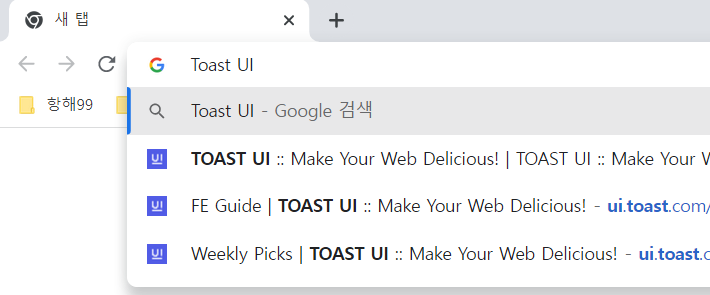
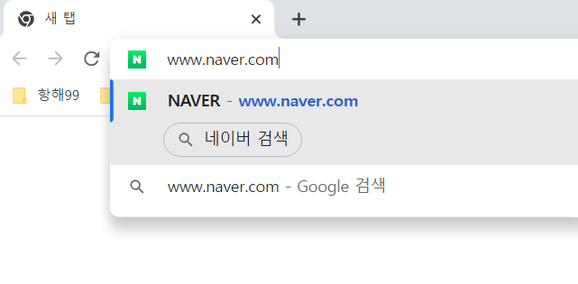
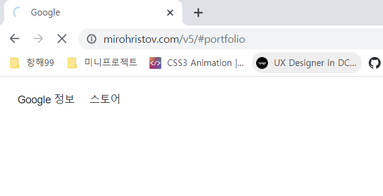
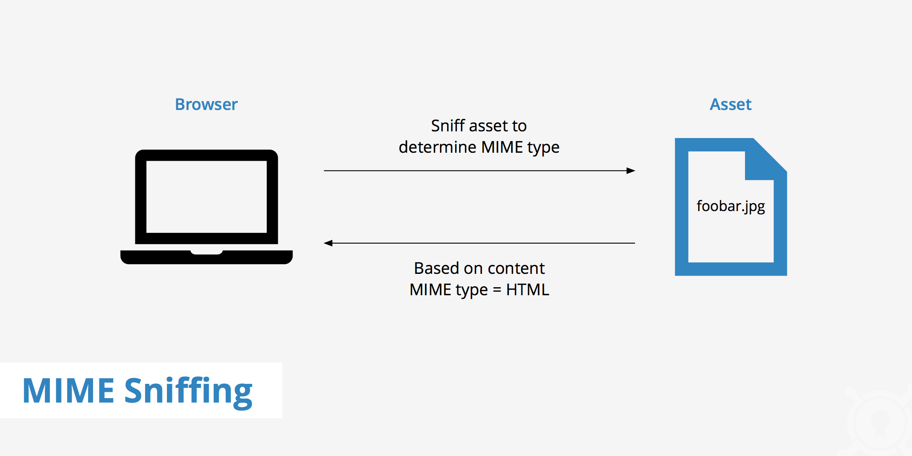

[학습자료: 가장 쉬운 웹개발 with Boaz](https://www.youtube.com/watch?v=ipwfEUslfQA)
[학습자료: 우당탕탕 개발](https://oizys.tistory.com/36)

# What happens when type google..?

### 질문의도
브라우저에 URL를 입력 후 엔터쳤을때 실제로 어떠한 과정으로 웹 페이지가 요청되는지에 대한<br/>
내용을 물어보는 질문이다.

## 설명

### 1. Handling inputs - URL창에 텍스트를 입력
- 브라우저 프로세스안의 UI 쓰레드가 입력된 텍스트가 <code>search query</code>인지 <code>URL</code>인지
판단
  - <code>search query</code>가 입력된 경우 search engine으로 query를 보내 검색을 준비
  

  - <code>URL</code>이 입력된 경우 네트워크 쓰레드로 URL값을 전달할 준비
  


### 2. Start Navigation - 사용자가 Enter키를 입력
- UI 쓰레드가 로딩 스피너가 탭 왼쪽에 그리고 네트워크 쓰레드에게 URL을 전달 -> network call initiates

- 네트워크 쓰레드가 URL 정보를 파싱
- HSTS (HTTP Strict Transport Security) 목록을 통해 요청된 URL이 HTTPS로 보낼지 HTTP로 보낼지 결정
- 브라우저에 캐싱된 DNS 기록을 확인하여 대응하는 IP 주소가 있는지 확인한다.
- 캐싱된 기록이 없으면 DNS 서버가 요청된 URL을 호스팅하고 있는 서버의 IP 주소를 찾기위해 DNS query를 날린다.
- 브라우저가 올바른 IP 주소를 받게 되면 서버와 connection을 빌드하게 된다.<br/> 
브라우저는 인터넷 프로토콜을 사용해서 서버와 연결이 된다. 인터넷 프로토콜의 종류는 여러가지가 있지만,<br/>
웹사이트의 HTTP 요청의 경우에는 일반적으로 TCP를 사용한다.<br/>
  클라이언트와 서버간 데이터 패킷들이 오가려면 TCP connection이 되어야 한다.<br/> TCP/IP three-way handshake라는 프로세스를 통해서 클라이언트와 서버간 connection이 이뤄지게 된다.<br/> 단어 그대로 클라이언트와 서버가 SYN과 ACK메세지들을 가지고 3번의 프로세스를 거친 후에 연결이 된다.

  - 클라이언트 머신이 SYN 패킷을 서버에 보내고 connection을 열어달라고 물어본다
  - 서버가 새로운 connection을 시작할 수 있는 포트가 있다면 SYN/ACK 패킷으로 대답을 한다
  - 클라이언트는 SYN/ACK 패킷을 서버로부터 받으면 서버에게 ACK 패킷을 보낸다

- TCP 연결이 완료되면 데이터를 요청한다.

### 3. Read Response - response body가 네트워크 쓰레드로 들어올때
- response header의 content-type을 확인, content-type을 정확히 확인하니 위해 MIME type sniffing 과정을 거침


- content-type을 확인하는 과정에서  
  - HTML type일 경우 Renderer 프로세스에게 파일을 전달하기 위한 준비
  - HTML type이 아닐 경우, 예를 들어 zip 파일일때 Download manager에게 파일을 전달 준비

- content-type 확인 과정이 끝난 후 안전한 페이지인지 확인하는 단계로 2가지 절차를 거친다.
  - 첫번째 SafeBrowsing
  ```markdown
  도메인과 데이터가 known malicious site(악의적인 사이트)인 경우 warning page를 보여줌
  ```
  - 두번째 CORB(Cross Origin Read Blocking)
  ```markdown
  민감한 cross-site 데이터인지를 확인하여 renderer process에게 전달할지를 결정
  ```

### 4. Find Renderer process - 네트워크 쓰레드가 확인이 끝난 후 브라우저가 사이트를 이동해야 한다면
- Read Response 단계를 거처 안정성이 확보된 데이터를 네트워크 쓰레드가 UI 쓰레드에게 전달 (data is ready 상태)
- UI 쓰레드가 Start Navigation 단계에서 찾아놓은 Renderer 프로세스에게 데이터(html file)을 전달


### 5. Commit Navigation - data, Renderer 프로세스가 준비되면
- 브라우저 프로세스가 Renderer 프로세스에게 해당 페이지 정보를 렌더링 해달라는 요청을 보낸다 (IPC)
- Renderer 프로세스가 브라우저 프로세스로 부터 commit navigation 되었다는 컨펌을 확인하면 document loading phase가 시작된다. 이 과정에서는 아래와 같은 작업이 이루어진다.
  - 주소창 업데이트 (현재 브라우저 접속 URL 변경)
  - security indicator & site settings UI reflect new page information (신뢰할수있는 페이지 아이콘 등 브라우저 UI 업데이트)
  - session history for the tab updated (history 정보를 저장하고 업데이트)
    - forward/back button에 방금 방문한 사이트 추가
    - 탭/윈도우 닫을 때 복구 기능을 위해 session history is stored on disk

### 6. Initial load complete - navigation is committed
- Renderer 프로세스는 계속 적으로 페이지 필요한 외부 자원을 로딩하고 렌더링 한다.
- 렌더링이 끝나면 UI 쓰레드에서 로딩 스피너를 탭에서 지움
